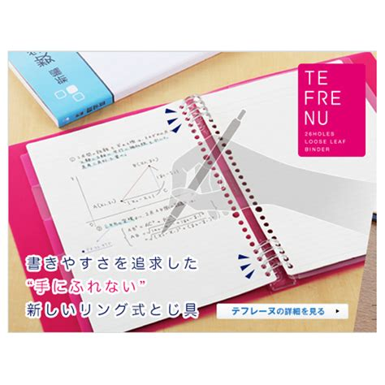

How do you read a textbook? For most of us, the answer is simple - read it from the start of the assigned chapter to the end. But it's boring, and making notes can seem difficult at times where we dont know what to write, how much to write and how to organise our notes. Many of us might even go through several iterations of rewriting notes while others may simply give up and just skim the textbook.

Personally I've been diligent about reading books the "proper" way, end-to-end with notes and doing all exercises/questions in the middle. It worked with learning Japanese and all the way through the schooling system. However this all came crumbling down after I entered National Service

# Too many books, too little time

That's right, my masochistic brain decided to pile up a whole bunch of textbooks that deep down I know I'll never read, and guilt myself every time I do anything non-productive, knowing there's quite literally an infinite amount of work I need to do. Setting aside projects, coding, practices, hobbies and every other task in my lists, I've decided to try tackling the idea of studying from textbooks, in preparation for reading [SICP](https://web.mit.edu/alexmv/6.037/sicp.pdf) for uni.

# The basics

Skimming the internet, there's plenty of methods to take down notes from a lecture, such as the [Cornell method](http://lsc.cornell.edu/study-skills/cornell-note-taking-system/), but I've found most methods woefully inefficient for books I intend to skim since I don't actually need to know 100% of the material I touch. I mean the history of Lisp while interesting in its own right won't help me as much as say learning what a map function is. 

## The solution

I decided to bastardise a couple of methods I've found online into the following workflow.

1. (where relevant) look at the guiding questions of the chapter
2. Look at the boldened words and record them down on some scrap paper
3. Skim the material. It's ok if you don't remember all the details, just the important bits. Leave a summary for each section of about 1 sentence per paragraph. 
4. For long, important-ish bits that don't seem relevant yet, leave a reference in your notes containing a summary of the material skipped and the page number
5. If you have sufficient enough doubts about the boldened words so far, re-read those sections carefully, else leave a remark in your notes in that
6. try the easy questions, then move on
7. If for some reason you need a stronger understanding of the material, attempt the hard questions after completing the book

## But why?

The idea here is to read more books than to understand each book in it's entirety. This is to free up more time to read up on new, untouched fields that wouldn't have been touched to begin with had you just been reading just the required material the entire time, plus you can always just revisit the book whenever needed and rewrite the notes that end up being too short. In the long-run this would result in time savings from over-analysing fluff and get you to apply stuff in real life quicker which usually ends up yielding the highest returns on time.

To make this process more efficient I also like to use a loose leaf folder to make it easier to rip out pages that end up being of too low quality or too little content.

Now I'm off to apply this to SICP and I'll report back once I've properly field-tested this.

Overfitted signing out