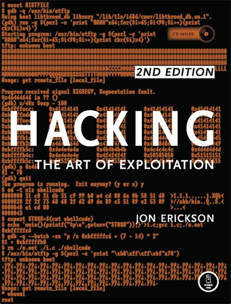
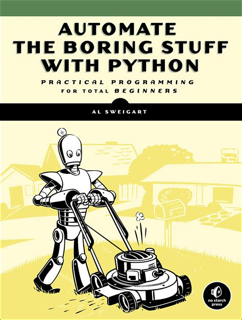

Heya, Overfitted back at it with my second blog post!

I decided to essentially roughly go through my experiences till now in the field of Computer Science, to give some sense of context to my future blog posts and maybe to encourage you readers to follow me on my journey.

I'm about to enter Computer Science in the National University of Singapore (NUS) next month. I have about 5 years of experience in programming and programming-adjacent activities including my first 3 years spent durdling around studying tutorials but not even putting a single script on Github. My Github profile right now is so depressing I decided to raze the whole thing and pretend to not even know what a git commit is 0.o

For reference, I highly recommend the first couple chapters of Pro Git to anyone just starting out, at least until the chapter on Rebasing so you can at least get a feel for it and have a way to archive your efforts studying (you would be surprised how much people can be impressed by material literally copy and pasted from tutorials, but don't ruin it for the rest of us pls)

# The Prologue - durdling about

Anyway, I initially started out learning about basic HTML/CSS in Secondary School, after a friend of mine bragged about being part of a lucrative web design business. Naturally I was pretty impressed at a fellow snot-nosed kid actually making the bucks doing adult business so I naturally picked up a dummies guide to web development which I neglected to read for so long most of the material became outdated to the point of unusability (flash anyone?)

Can't recommend the dummies guide for anything so far sorry. There are just way too many better resources of which many are free online (legally too!)

I continued learning about web development in Junior College making use of Udemy (overpriced) and freecodecamp up till JQuery when I of course lost interest and started learning cybersecurity because being an Uber Hax0r seemed pretty cool. It really is but it can be mind-meltingly boring. To anyone thinking of joining the field I highly recommend joining Div0 and null meetups and following courses over at TryHackMe as like a weenie hut junior introduction to how the field can be pretty cool, then reading Hacking: The Art Of Exploitation for a reality check so you can finally understand how binary exploitation works.

Honestly though, I would highly recommend avoiding this at first in favour of learning how your target works the legit way. For example, before learning how to exploit SQL databases you should probably learn what a "SQL" is and how to actually build such a database yourself. It feels extra cool when you down the line "hack" your own projects and learn how to make them safer.

Seperately, I started learning about how arduinos work for an engineering challenge and I've got to say it honestly wasn't as hard as I expected so long as you temper your expectations on what "programming" is. I mean I literally copy and pasted everything for much of this time and only bothered learning how to properly write arduino scripts after graduating from Junior College. Hardest part was probably learning about all the different sensors, scrounging up a budget and learning how resistance worked. (yes somehow I managed to get exempted from taking physics in Upper Secondary School because Bio seemed fun)

# Falling down the SWE rabbit hole

Post-JC I proceeded to properly learn how python works (yes this late in the game wow) using codeacademy (feel free to skip this) and followed Automate the Boring Stuff with Python to automate repetitive web and excel-related stuff while working at a boring clerical desk job. In hindsight Javascript and VBA would make more sense but I had sunk way too much time into python by the time I came to that realisation. I still highly recommend the book though, it's excellent and gives you practical instructions on how to do real life useful scripts and is very beginner-friendly

skipping over some pretty cool conferences, hackathons, volunteer work and minor projects, (VOLUNTEER! There's free pizza, shirts and sometimes drinks!) as well as some half-baked attempts at entering various IT fields (AI, microservices and many obscure languages) here I am. I feel semi competent? Mostly because of the projects I completed back at the desk job. I sadly do not feel confident in sharing them though because they were a flaming dumpster fire of confidential information and uncommented nonsense. 

In terms of lessons learnt, biggest one is to not shop around too much for a "good" resource. If you have a video tutorial series, finish it. If you have a book, also finish it. But do things one at a time and to completion where possible when you first start. Even if your information is incomplete or outdated, most of it tends to be transferable since much of IT is first about concepts, then about how to apply them. Same applies for picking a first language. Just learn python. It's fun, easy, has no annoying semicolons nor pointers nor type declarations, and you can do fancy stuff like web scraping, facial recognition and back-end web development.

Lastly but most importantly, don't be afraid to keep banging your head against the wall (METAPHORICALLY). What I mean is if you fail, dont worry and trust in the process. You will eventually remember how to type a function declaration through muscle memory if nothing else. Google will eventually yield answers or if not you can always bug someone at a meetup for help. The worst thing you can do is give up or procrastination - heck I was guilty of that for the first half of my experience. Beware looking for tutorials for things you already know is counted. If you vaguely know how something works that's good enough to start tinkering. As the old adage goes, "if it works it ain't stupid".

Man it's literally 3:30am now, this really took me way too long to type out lol

Overfitted signing out from my severely outdated PC in my bedroom